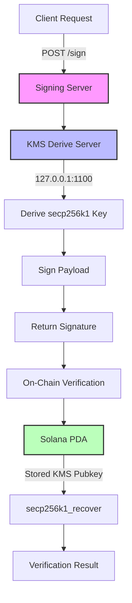
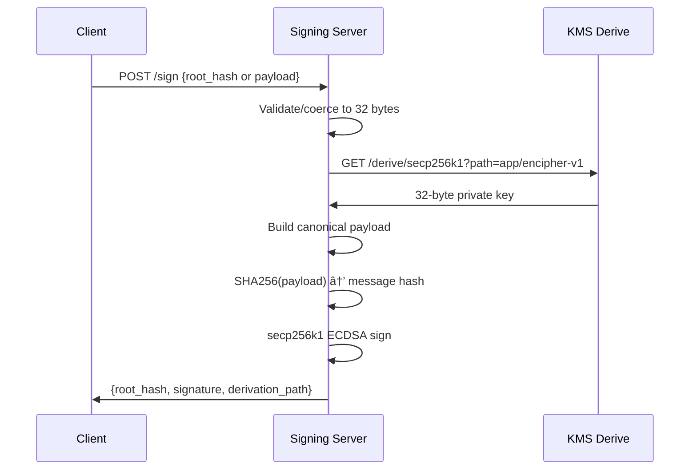
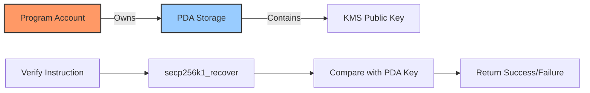
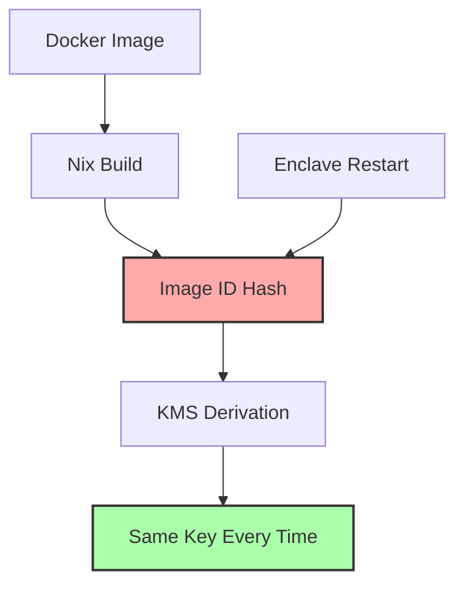

# Marlin Signature and Verification
It provides a trustless signing service where signatures are generated inside TEEs using deterministically derived secp256k1 keys. These signatures can be verified on-chain without exposing private keys, ensuring complete transparency and security
### Core Components

1. **Signing Server** - HTTP service running inside Oyster CVM enclave that signs payloads using KMS-derived secp256k1 keys
2. **Nautilus KMS Integration** - Local derive server providing deterministic key derivation based on enclave identity path
3. **On-Chain Verifier** - Solana program storing public keys in PDAs and verifying signatures trustlessly
4. **Canonical Payload Format** - Standardized message encoding ensuring signature consistency

## Architecture Flow



## Nautilus KMS Integration

The signing server integrates with Nautilus KMS through a local derive server running at `127.0.0.1:1100` inside the enclave. This ensures keys are derived deterministically based on the enclave's identity.

### Key Derivation Process

**Derivation Path Structure:**
```
app/{app_id}                                    # Basic path
app/{app_id}/variant-{variant}/build-{hash}    # With binding
```

**Default Path:** `app/encipher-v1`
This path will be updated later when adding epoch based key derivation for signatures.

**Endpoints:**
- Private Key: `GET http://127.0.0.1:1100/derive/secp256k1?path={derivation_path}`
- Public Key: `GET http://127.0.0.1:1100/derive/secp256k1/public?path={derivation_path}`

### Key Characteristics

**Private Key:**
- Format: 32-byte binary
- Deterministic: Same enclave image ID -> same key
- Never exposed outside enclave

**Public Key:**
- Compressed: 33 bytes
- Uncompressed: 64 bytes (x,y coordinates) for on-chain storage
- Example: `03ba363e9a10c7ff2dee3c3b01c48e280ac2bee7a7d49c0f0d081ccc18c5896972`

## Signing Process

### Canonical Payload Encoding

The server uses a deterministic payload format to ensure signature consistency:

| Component         | Encoding                          |
|-------------------|-----------------------------------|
| Domain            | `"MARLIN_APP_V1"` + null byte     |
| Chain ID Length   | 2 bytes (u16 BE)                  |
| Chain ID          | UTF-8 bytes                       |
| App ID Length     | 2 bytes (u16 BE)                  |
| App ID            | UTF-8 bytes                       |
| Root Hash         | 32 bytes raw                      |


### Signature Generation



**Signature Format:**
- Algorithm: secp256k1 ECDSA
- Hash: SHA256 of canonical payload
- Output: 64 bytes (r,s components)
- Recovery ID: 0-3 (for public key recovery)

## API Endpoints

### POST /sign

**Request Options:**
```json
// Option 1: Direct 32-byte hex hash
{"root_hash": "0x1234567890abcdef1234567890abcdef1234567890abcdef1234567890abcdef"}

// Option 2: Arbitrary string (server hashes it with SHA-256)
{"payload": "any text to be signed"}

// Optional parameters
{
  "root_hash": "0x1234...",
  "chain_id": "solana-devnet",  // Optional, defaults to config
  "app_id": "encipher-v1"       // Optional, defaults to config
}
```

**Response:**
```json
{
  "root_hash": "0x1234567890abcdef1234567890abcdef1234567890abcdef1234567890abcdef",
  "signature": "9dc4b63969e30f43887af32d61294d64b5fb1212da8563c3975b3c40526552d32a7346967fc571b07c0af85801da08bb0e27d34473bfc17701f1d138e2bb80b9",
  "derivation_path": "app/encipher-v1"
}
```

**Error Response:**
```json
{
  "error": "Invalid root hash format: Hash must be 32 bytes (64 hex characters)",
  "code": 400
}
```

### GET /healthz

**Response:**
```json
{
  "status": "healthy",
  "version": "0.1.0"
}
```

## On-Chain Verification (Tested on Solana Devnet)

The verification system uses Solana's native secp256k1_recover instruction to verify signatures trustlessly.

### Program Architecture




### PDA Storage Structure

```rust
VerifierState {
    discriminator: [u8; 8],     // Anchor discriminator
    is_initialized: bool,        // 1 byte
    secp256k1_pubkey: [u8; 64], // Uncompressed public key
    bump: u8                     // PDA bump seed
}
// Total: 74 bytes
```

### Verification Flow

1. **Client submits** message hash + signature + recovery_id
2. **Program reads** stored KMS public key from PDA
3. **Program calls** `secp256k1_recover(hash, signature, recovery_id)`
4. **Program compares** recovered key with stored key
5. **Returns** verification success or failure

**Key Storage:**
```
Stored KMS Key: 6583a117b4a05c8e1c3e1d2f764e317de2f21e51ec6d74c36385a7b5cd1e02ce0581f7698caa204e43b47180015df260ac193fdcf61202c3a70aa84a914906a4
Format: 64-byte uncompressed (x,y coordinates)
```

## Deployment on Oyster CVM

### Docker Container Build


### Oyster Deployment Process

```bash
# 1. Build and push Docker image
docker build -t username/encifher-server:latest .
docker push username/encifher-server:latest

# 2. Deploy to Oyster CVM
oyster-cvm deploy \
  --wallet-private-key <key> \
  --duration-in-minutes 60 \
  --docker-compose docker-compose.yml \
  --arch amd64

# 3. Verify attestation
oyster-cvm verify \
  --enclave-ip <ip> \
  --image-id <computed_image_id>
```

**Deployment Configuration:**
```yaml
services:
  encifher-server:
    image: username/encifher-server:latest
    ports:
      - "8080:8080"
    environment:
      - CHAIN_ID=solana-devnet
      - RUST_LOG=info
```

## Image ID and Key Persistence setup

The system leverages Oyster's deterministic image IDs to ensure key persistence across enclave restarts.



**Image ID Sources (Priority):**
1. `IMAGE_ID` environment variable
2. `/app/image_id` file
3. `/init-params/image_id` file
4. `ENCLAVE_IMAGE_ID` environment variable
5. Fallback hardcoded value

**Key Persistence Guarantee:**
- Same image ID → Same derivation path → Same secp256k1 key
- Keys survive enclave restarts
- Keys change only when image changes

## Practical Usage Examples

### Signing a Message

**Example 1: Sign with 32-byte hash**
```bash
curl -X POST http://43.205.164.3:8080/sign \
  -H "Content-Type: application/json" \
  -d '{"root_hash": "0xabcdefabcdefabcdefabcdefabcdefabcdefabcdefabcdefabcdefabcdefabcd"}'
```

**Response:**
```json
{
  "root_hash": "0xabcdefabcdefabcdefabcdefabcdefabcdefabcdefabcdefabcdefabcdefabcd",
  "signature": "2239dcf6cb8126ab65c9d892a6d2af0121c3fefb8742aaab74444f690a1e204f39d4c3d7388d911a53f2f51c2e05ba67c69c0b1977517a3256ad98d1a45acead",
  "derivation_path": "app/encipher-v1"
}
```


### Deriving Public Key

```bash
# Get KMS-derived public key for verification
oyster-cvm kms-derive --image-id ec55a64e04b62482577d9ec35da5bd446613cb63a7
```

**Response:**
```
6583a117b4a05c8e1c3e1d2f764e317de2f21e51ec6d74c36385a7b5cd1e02ce0581f7698caa204e43b47180015df260ac193fdcf61202c3a70aa84a914906a4
```

## Troubleshooting

### Common Issues and Solutions

#### 1. KMS Connection Failed
**Error:** `KMS error: KMS request failed: error sending request`

**Solution:**
- In development: This is expected
- In production: Ensure the enclave is running inside Oyster CVM
- Check if local derive server is accessible at `127.0.0.1:1100`


#### 2. Signature Verification Failed On-Chain
**Error:** Program simulation returns error

**Solution:**
- Verify the correct recovery ID (0-3) is being used
- Ensure the message hash construction matches the server's canonical format
- Check that the PDA contains the correct KMS public key
- Verify Program ID and PDA address are correct


#### 3. Oyster Deployment Issues
**Error:** `Insufficient balance` or deployment fails

**Solution:**
```bash
# Check wallet balance
oyster-cvm list --address <wallet_address>

# Ensure sufficient USDC for deployment duration
# Rate: ~0.11 USDC/hour
```

#### 4. Docker Build Platform Issues
**Error:** Platform mismatch warnings

**Solution:**
```bash
# Specify platform explicitly
docker build --platform linux/amd64 -t encifher-server .
```

#### 5. Environment Variable Not Set
**Error:** Server starts with unexpected configuration

**Solution:**
```bash
# Check current configuration
cat .env

# Required for production
export CHAIN_ID=solana-devnet
export RUST_LOG=info
```

### Verification Checklist

1. **Server Health:**
   ```bash
   curl http://<server>:8080/healthz
   # Should return: {"status":"healthy","version":"0.1.0"}
   ```

2. **Signing Works:**
   ```bash
   curl -X POST http://<server>:8080/sign \
     -H "Content-Type: application/json" \
     -d '{"payload": "test"}'
   # Should return signature and derivation_path
   ```

3. **KMS Key Matches:**
   ```bash
   oyster-cvm kms-derive --image-id <image_id>
   # Compare with key stored in Solana PDA
   ```

4. **On-Chain Program Active:**
   ```bash
   solana program show 7qgH9gWGotrTK5UobXFLWR6gcpFPBsYuu8jRMH8FxMVf --url devnet
   ```


