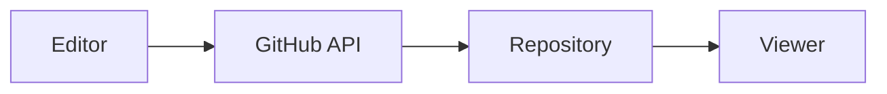

# Test Blog Post

This is a test blog post created to verify the editor → GitHub → viewer workflow.

## Features Being Tested

- **GitHub Push**: Does this post get pushed to the repository?
- **Viewer Display**: Can the viewer fetch and display this post?
- **Mermaid Support**: Do diagrams render properly?



## Code Example

```javascript
const testFunction = () => {
  console.log("Testing syntax highlighting!");
  return "success";
};
```

**Status**: Testing complete workflow

*Created*: $(date)
*Tags*: #test #blog #workflow
